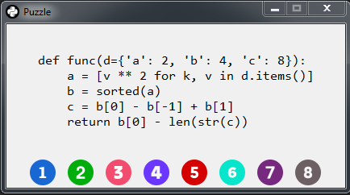
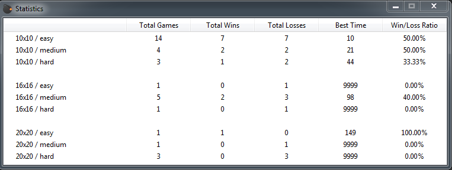

# PySweeper
<br>

## Rules

- The objective is to reveal all safe cells without encounter any snake.
- Left-click to reveal cells. The number inside a cell indicates the number of neighboring snakes.
- Right-click to flag potential snakes. Use flags to mark cells you suspect contain snakes.
- Be cautious! If you reveal a cell with a snake, you lose the game.
- Win by revealing all safe cells.
<br>

## Features

- **Programming Puzzles:** Tackle logic puzzles to reveal safe squares.
- **User-Friendly Interface:** Simple yet intuitive interface for a good gaming experience.
- **Various Difficulty Levels:** Choose from easy, medium, and hard difficulty levels to suit your preference.
- **Grid Sizes:** Play on grid sizes of 10x10, 16x16, or 20x20.
- **Statistics:** Track your performance with detailed statistics.
- **Cool icons & sounds:** Enjoy clear visuals and nice sounds for a great experience.
<br>

## Difficulty Levels

- **Easy:** Perfect for beginners. No programming puzzles; simply focus on revealing safe squares.
- **Medium:** Provides simple Python programming puzzles to solve while playing.
- **Hard:** Offers more complex programming puzzles, for players seeking a greater challenge.
<br>

## Clone Repository and Start the Game
```bash
git clone https://github.com/georgescutelnicu/PySweeper.git
```
```bash
python main.py
```
<br>

## Prerequisites
- Make sure you have Python 3.x installed on your system.
<br>

## Screenshots



