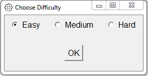
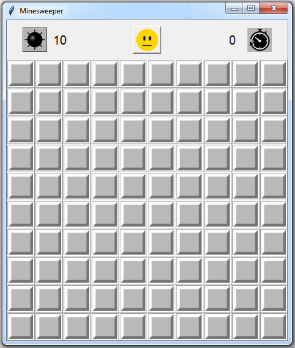
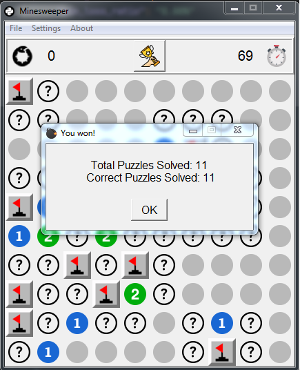
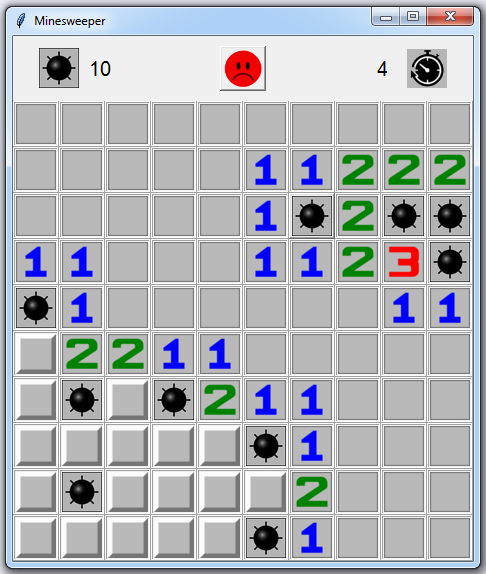

# Minesweeper


<br>

## Rules
- The objective is to reveal all safe cells without detonating any mines.
- Left-click to reveal cells. The number inside a cell indicates the number of neighboring mines.
- Right-click to flag potential mines. Use flags to mark cells you suspect contain mines.
- Be cautious! If you reveal a cell with a mine, you lose the game.
- Win by revealing all safe cells.
<br>

## Choose your preferred challenge:
- **Easy:** 10x10 grid, 10 mines
- **Medium:** 16x16 grid, 40 mines
- **Hard:** 20x20 grid, 70 mines

<br>

## Technologies Used
- Python
- Tkinter

<br>

## Clone Repository and Start the Game
```bash
git clone https://github.com/georgescutelnicu/minesweeper.git
```
```bash
python main.py
```
<br>

## Prerequisites
- Make sure you have Python 3.x installed on your system.

<br>

## Screenshots




